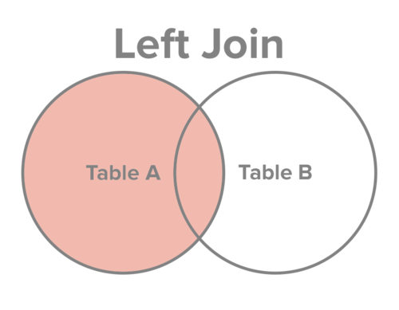

```{r setup, include=FALSE}
knitr::opts_chunk$set(echo = TRUE)
```

## About this notebook

This notebook will review the concepts introduced in the in_class_06 assignment:   
In particular, it will show:

* basics of joining data sets together with "joins".

## How to work through this notebook

This notebook contains text and code that I have written.  

You should read the text.  

When you see **Task**, that's an indication that you should do one of several things as instructed:

* **Task (Run Code): ** Run some code I've written in a codeblock and examine the output, answering a question if required.
* **Task (Edit and Run Code): ** Edit some code I've written in a codeblock, run it, and examine the output, answering a question if required.
* **Task (Write and Run Code): ** Write some code of your own inside of a codeblock I've already created and run it, answering a question if required.
* **Task (Create a Codeblock, Write and Run Code):** Create a codeblock in the existing whitespace of the markdown file, write some code inside of it, run it and answer a question if required.
* **Task (Watch Video): ** Run a codeblock that contains a YouTube video, and then watch the video. In the video, I may explain a concept, or assign you to do something that is not detailed in the text.
* NOTE: Venn diagrams from [here](http://www.sql-join.com/sql-join-types)

## Submission details

When you're finished all the tasks, you should save your file in RStudio; commit the changes in GitHub desktop; and push the changes to your repo on GitHub.com.  Then you'll submit the GitHub.com link on ELMS.

## Load Packages

There are two packages you'll need to load today:

* The Tidyverse, so we can analyze data the tidyverse way.
* Vembedr, so you can load the videos directly in the markdown notebook.

**Task (Run Code)**: Run the code block below to load the Tidyverse and Vembedr. Note the special instructions in comments, if you are using a new computer to run this notebook.

```{r}
# If you are on a new machine you haven't used before, you may need to install these packages before loading.  If that's the case, remove the comment # from in front of the next two lines before running the codeblock, to install the packages before loading.
# install.packages('tidyverse')
# install.packages('vembedr')

# Load the tidyverse, vembedr
library(tidyverse)
library(vembedr)
```

## Load Data

### First data set | average opioid shipments by county
Our first data set comes from the Washington Post's opioid pill shipment ARCOS data [ARCOS](https://www.washingtonpost.com/graphics/2019/investigations/dea-pain-pill-database/#download-resources).  

Each row is a county. For almost every county in the U.S. we have the average number of pills of hydrocodone and oxycodone sent to that county between 2006 and 2014. Here are the columns:

* countyfips | unique id for each county
* buyer_county | character | name of county
* buyer_state | character | two letter state code
* average_pills_per_year | average number of pills sent to county between 2006 and 2014. 

### Second data set | county population
Our second data set comes from the census, and it has population for each county (the average annual population for each year between 2006 and 2014). Here are the columns:

* countyfips | unique id for each county
* buyer_county | character | name of county
* buyer_state | character | two letter state code
* population | county population 

**Task (Edit and Run code)**: Run the necessary code below to load the data we'll be using today. I've written the code for the first one.  The second one is incomplete.  You need to put the correct path to the data to get it to load.

```{r}
# Load county pills data
county_pills_per_year <- read_csv("data/county_pills_per_year.csv")

# Edit the line below to load county population data. Something is missing inside of the read_csv() function. The file is called "county_population_per_year.csv" and it's in the data folder. 
county_population <- read_csv() 

```

### Examining data with glimpse()

**Task (Edit and Run code)**:  In the empty codeblock below, edit the existing code to glimpse the covid_county dataframe. You'll need to add the name of the dataframe inside the glimpse function.

```{r}
# glimpse county pills data
glimpse()
# glimpse county population data
glimpse()

```

## Joins

### Motivating question

Our motivating question today, the thing we're going to set out to answer, is this: which county had the highest number of pills shipped to the county PER PERSON? 

To answer it, we need to be able to divide the number of pills sent to each county by the population for each county.

The catch: the data we need to answer this question is stored in two separate tables.  

* county_pills_per_year has the info on pills for 3,130 counties
* county_population has the population for 3,143 counties

### Joining the data

First, we need to put our two tables together.

Fortunately, each table shares at least one common field -- a unique id for each county, the name of the county and the name of the state.  

And because they share that common feature, we can put them together with a "join."  There are several types of joins, but the "inner_join" is the one we're going to use.  

Let's do that together now.  

**Task (Run code)**: Run the code to put the two tables together, storing it as a new object called "county_pills_population".

```{r}
county_pills_population <- county_pills_per_year %>%
  inner_join(county_population)
```

**Task (Watch Video)**: Watch video below, and I'll explain what happened here behind the scenes. 

```{r}
# Video A 
# Click play to run the codeblock and the video will display in the markdown document. 
embed_youtube("uZXIPLQ7wb4", width = "100%", height="480", frameborder = 0,
allowfullscreen = FALSE, query = NULL)

# If the video doesn't work here, load this URL in your browser: 
# https://youtu.be/uZXIPLQ7wb4

```

## Answer our question

Let's use this new table to answer our original question: which county had the highest number of pills shipped to the county per person? 

If you get stuck, look back at this week's in class class assignment for a clue.

**Task (Edit and Run code)**:  In the empty codeblock below, edit the existing code to answer the question.
```{r}

most_pills_per_person <- county_pills_population %>%
  # add a line here to create a new column with pills per person AND THEN
  # add a line here to sort the new column from highest to lowest 


# Put the answer here
```

## Different types of joins

There are different types of joins -- inner, left, right, full and others.  

The type of join we use determines what records (rows) get returned in the new table we create. 

### Inner joins

Inner_joins are probably the most commonly used type of join. 

An inner join creates a new table that puts two tables together based on a shared column (or columns) and only returns a row if there's an exact match.   

A common way of visualizing which records are returned is with a Venn diagram.

Suppose we have two tables -- Table A (county_pills_per_year) and Table B (county_population) --  we want to combine, and they share some common fields (countyfips, buyer_county, buyer_state). 

With the Venn diagram, we can visualize this by having the circles that represent our tables overlap, like so: 


An inner join returns all columns from both tables.  But it only returns those rows where there's a match in both tables in the three columns we're joining on (countyfips, buyer_county and buyer_state).

If there's not a match, those records get dropped from the new table we create with the join. Only records that match are kept. 

With a Venn diagram, we visualize an inner join this way. 

The pink shaded part indicates which records are returned -- only those with an exact match in both table A and table B. 


**Task (Run code)**:  Run the code to use an inner join to connect county_pills_per_year and county_population. 

```{r}
county_pills_population <- county_pills_per_year %>%
  inner_join(county_population)
```

**Task (Watch Video)**: Watch video below, and I'll explain what happened here behind the scenes. 

```{r}
# Video b
# Click play to run the codeblock and the video will display in the markdown document. 
embed_youtube("vk9N4jkZRQM", width = "100%", height="480", frameborder = 0,
allowfullscreen = FALSE, query = NULL)

# If the video doesn't work here, load this URL in your browser: 
# https://youtu.be/vk9N4jkZRQM

```

### Left joins

Another type of join is called a "left join". 

It's a little bit different from an inner join. 

Like an inner join, a left join returns all columns from both tables.  

Unlike an inner join, it returns ALL rows from Table A (county_pills_per_year) regardless of whether there's a match in Table B (county_population).  If it finds a match in Table B, it will pull that information in and put it in the appropriate column.  If it doesn't find a match, it leaves it blank.

A Venn diagram for the left join looks like this:



**Task (Run code)**:  Run the code to use a left join to connect county_pills_per_year and county_population. 

```{r}
county_pills_population <- county_pills_per_year %>%
  left_join(county_population)
```

**Task (Watch Video)**: Watch video below, and I'll explain what happened here behind the scenes. 

```{r}
# Video c
# Click play to run the codeblock and the video will display in the markdown document. 
embed_youtube("YjcgraKC8Ik", width = "100%", height="480", frameborder = 0,
allowfullscreen = FALSE, query = NULL)

# If the video doesn't work here, load this URL in your browser: 
# https://youtu.be/YjcgraKC8Ik

```

## Right Join

A "right join" is the opposite of a left join.

Again, it returns all columns from both tables.  

It returns ALL rows from Table B (county_population) regardless of whether there's a match in Table B (county_pills_per_year).  If it finds a match in Table A, it will pull that information in and put it in the appropriate column.  If it doesn't find a match, it leaves it blank.

A Venn diagram for the a right join looks like this:


**Task (Run code)**:  Run the code to use a right join to connect county_pills_per_year and county_population. 

```{r}
county_pills_population <- county_pills_per_year %>%
  right_join(county_population)
```

**Task (Watch Video)**: Watch video below, and I'll explain what happened here behind the scenes. 

```{r}
# Video d
# Click play to run the codeblock and the video will display in the markdown document. 
embed_youtube("X3iEjssEBys", width = "100%", height="480", frameborder = 0,
allowfullscreen = FALSE, query = NULL)

# If the video doesn't work here, load this URL in your browser: 
# https://youtu.be/X3iEjssEBys

```

## Looking Ahead and More Help

If you work through this lab and you find yourself a little confused about joins, you're not alone.  

Joins are among the most complicated concepts for new data journalists to grasp. With repetition, it should eventually get clearer. 

In future labs, there are other kinds of joins we'll examine -- full joins, anti joins, semi joins, nested joins. We'll look at "one-to-many" joins, and how joins can lead to factual errors if we aren't careful. 

For now, in case my explanations weren't adequate, I'm leaving you with a video someone else created that explains joins.  

If you find yourself in need of additional help, please watch it. Note that it starts to get into join types we'll cover in future labs. 

And there's a web page that contains more information [link](https://statisticsglobe.com/r-dplyr-join-inner-left-right-full-semi-anti). 

**Task (Watch Video)**: Watch video below, if you want another explainer on joins.

```{r}
# Video d
# Click play to run the codeblock and the video will display in the markdown document. 
embed_youtube("Yg-pNqzDuN4", width = "100%", height="400", frameborder = 0,
allowfullscreen = FALSE, query = NULL)

# If the video doesn't work here, load this URL in your browser: 
# https://youtu.be/Yg-pNqzDuN4

```

## You're done

When you're finished all the tasks, you should save your file in RStudio; commit the changes in GitHub desktop; and push the changes to your repo on GitHub.com.  Then you'll submit the GitHub.com link on ELMS.
